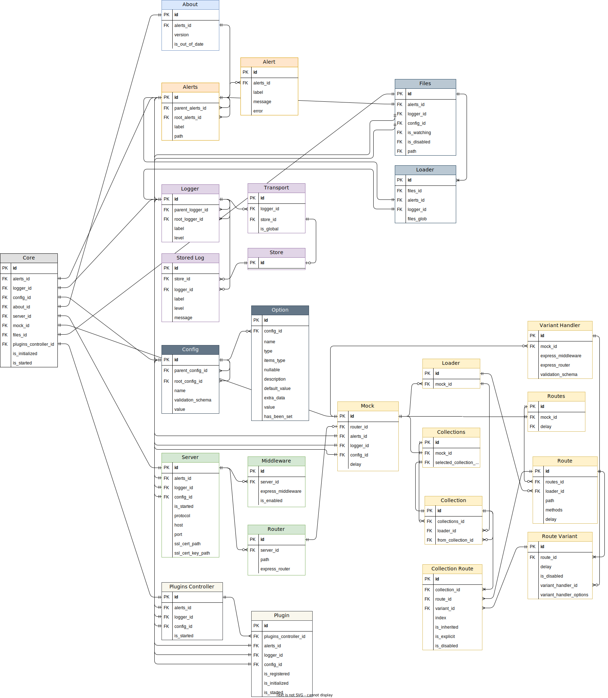

## Preface

In this section is described the conceptual data model of the Mocks Server core using an [entity-attribute-relationship diagram](https://en.wikipedia.org/wiki/Entity%E2%80%93relationship_model).
* The diagram uses "[Crow's foot notation/Martin notation](https://en.wikipedia.org/wiki/Entity%E2%80%93relationship_model#Crow's_foot_notation)" for describing the relations between entities.
* Domains are represented through different colors in entities headers.

:::info
The diagram is an __abstract representation of the entities, attributes and their relationships in the system__, and __it guides__ the development of the system itself and the related APIs, __but it is not an exact representation__ of the entities attributes or methods, which may defer depending on the API. Anyway, it may be still be very useful when using any of the available APIs, because they should be always be implemented with this model in mind, and represent the entities relationships as faithfully as possible.
:::

## Diagram

:::caution
Currently, the APIs are in the process of reengineering and for the moment some of their parts may not be fully compliant with the data model. They will be progressively adapted to it in coming releases.
:::

## Notes

### Unique entities

Even when some entities in the real implementation are in fact unique, the model still represents them having an `id` attribute, as if it would be possible to exist many instances of the entity. This was made because this is theoretically true, and many instances could exist, but in favor of simplicity in the APIs only one is created.

For example, the `Server` unique entity in the JavaScript API is accessible through the `core.server` attribute, and through the `/server` path in the REST API. A more faithful representation would be to make it available through `core.servers[0]` or `/servers/0`, for example, but this would possibly be more confusing from the API point of view. So, the API is developed with simplicity in mind, but the data model represents the possible scalability of the system.

## Source code and updates

The [diagram source code is available at this website's Github repository](https://github.com/mocks-server/website/edit/master/static/docs/data-model.drawio.xml) and it can be opened using [diagrams.net](https://www.diagrams.net/). Any modification in the document must be exported to XML and modified in the repository, as well as exported to SVG and updated in this page.
