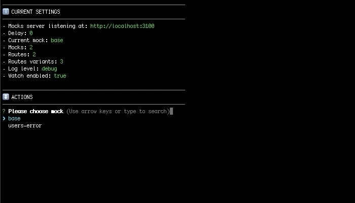

## The project

This project provides a mock server that can __simulate and store multiple API responses for each different route__. It can be added as a dependency of your project, and started simply running an NPM command.

Providing an interactive command line user interface and a REST API for __changing the responses of the API while it is running, it is easy to use both for development and testing__.

### Main features

* __Route variants__: Define different responses for a same [route](get-started-routes.md). Change the variant to use while the server is running.
* __Multiple mocks__: Mocks are __collections of route variants__. Group different [route variants](get-started-routes.md) into different [mocks](get-started-mocks.md). Change the current mock while the server is running using the [interactive command line interface](plugins-inquirer-cli.md) or the [REST API](plugins-admin-api.md).
* __Multiple formats__: Responses can be defined [using `json` or JavaScript files](guides-organizing-files.md). [Babel](https://babeljs.io/) is also supported, so [ESM modules and TypeScript can also be used](guides-using-babel.md).
* __Express middlewares__: Route variants [can be defined as `express` middlewares](guides-using-middlewares.md).
* __Proxy route variants__: Route variants [can be configured to proxy requests to another host and pass response back, and even modify the request or response data](guides-proxy-route-variants.md).
* __Multiple interfaces__: Settings can be changed using the [interactive CLI](plugins-inquirer-cli.md) or the [admin REST API](plugins-admin-api.md). The CLI is perfect for development, and the API can be used by automated tests, for example.
* __Integrations__: Integrations with other tools are available, as the [Cypress plugin](integrations-cypress.md).
* __Customizable__: You can [develop your own plugins](plugins-developing-plugins.md), or even [routes handlers](api-routes-handler.md), that allows to customize the format in which route variants are defined.

## Installation

Add it to your dependencies using NPM:

```bash
npm i @mocks-server/main --save-dev
```

Add next script to your `package.json` file:

```json
{
  "scripts": {
    "mocks" : "mocks-server"
  }
}
```

## Usage

Now, you can start Mocks Server with the command:

```bash
npm run mocks
```

When started for the first time, __it creates a scaffold folder__ named `mocks` in your project, containing next files and folders:

```
project-root/
├── mocks/
│   ├── routes/
│   │   ├── middlewares.js
│   │   └── users.js
│   └── mocks.json
└── mocks.config.js
```

The folder contains examples from this documentation providing a simple API with some route variants and two different mocks. You can use the interactive CLI that is also started to change the server settings and see how you can change the responses of the API changing route variants, changing the current mock, etc.



## How does it work?

It loads all files in the ["routes"](get-started-routes.md) folder, containing routes and variants definitions, and the ["mocks"](get-started-mocks.md) file, which defines sets of ["route variants"](get-started-routes.md).

```js
// mocks/routes/users.js
module.exports = [
  {
    id: "get-users", // id of the route
    url: "/api/users", // url in express format
    method: "GET", // HTTP method
    variants: [
      {
        id: "empty", // id of the variant
        response: {
          status: 200, // status to send
          body: [] // body to send
        }
      },
      {
        id: "error", // id of the variant
        response: {
          status: 400, // status to send
          body: { // body to send
            message: "Error"
          }
        }
      }
    ]
  }
]
```

The server will respond to the requests with the route variants defined in the current mock.

```json
// mocks/mocks.json
[
  {
    "id": "base", //id of the mock
    "routesVariants": ["get-users:empty", "get-user:success"] //routes variants to use
  },
  {
    "id": "users-error", //id of the mock
    "from": "base", //inherits the route variants of "base" mock
    "routesVariants": ["get-users:error"] //get-users route uses another variant
  }
]
```

Then, you can easily [change the responses of the API while the server is running](#configuration) changing the current mock, or defining specific route variants. This can make your __development or acceptance tests environments very much agile and flexible__, as you can define different ["mocks"](get-started-mocks.md) for each different API state that you want to simulate.

## Configuration

Configure the server simply [modifying the configuration file at the root folder of your project, or use command line arguments, or even environment variables](configuration-methods.md).

For changing [settings](configuration-options.md) (such as current mock, delay time, etc.) while it is running, you can use:
* [Interactive command line interface](plugins-inquirer-cli.md), which is very useful in local environments for development.
* [REST API](plugins-admin-api.md) which is very useful to change mock or route variants from E2E tests, for example, as the [Cypress plugin does.](integrations-cypress.md)

## Why a mock server?

Controlling the responses of the api will improve the front-end development workflow, avoiding early dependencies with back-end. It also improves the testing and development of error cases or another cases that are commonly hard to reproduce with a real API.

Defining the API responses during the earliest phases of development will improve the communication among team members and align their expectations.

Working with Node.js, it integrates better in front-end projects as any other NPM dependency, and it will be easier for front-end developers to maintain the mocks.

## Why "Mocks" in plural?

As explained, Mocks Server can store different mocks, which are sets of different route variants. So it can simulate multiple API states and send different responses to the same request at your convenience, so it is like having different mock servers that can be changed while running.

## Customization

Mocks Server is very customizable, and gives you the possibility of extend it with every new amazing feature you want:

- [Start it programmatically](api-programmatic-usage.md) and use its multiple methods and events to manage it from your program.
- Add new options and features [installing plugins](plugins-adding-plugins.md), or [developing your owns](plugins-developing-plugins.md).
- Add new [routes handlers](api-routes-handler.md), which allows to customize the format in which route variants are defined.
